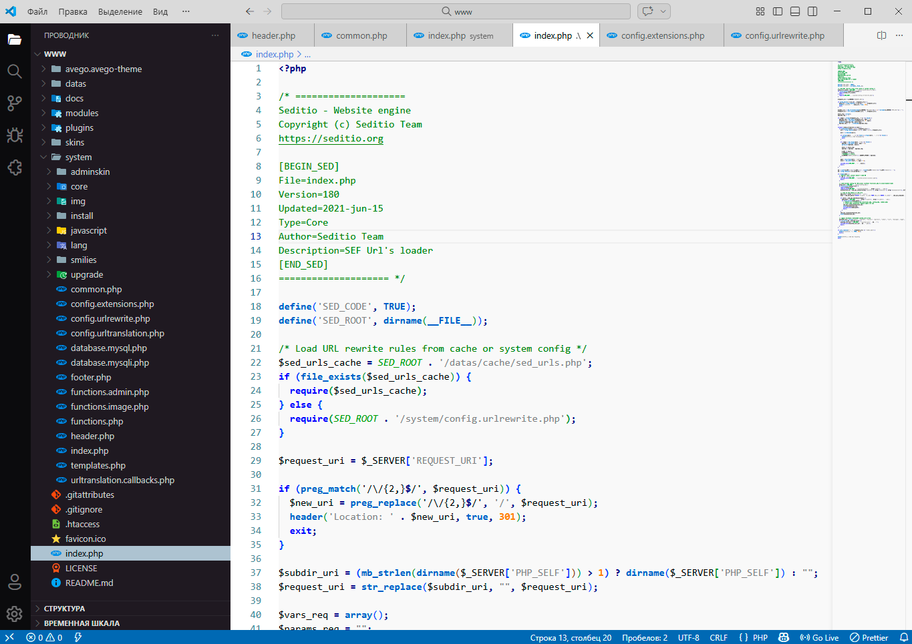
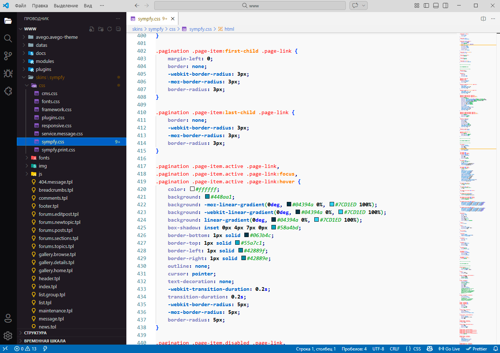
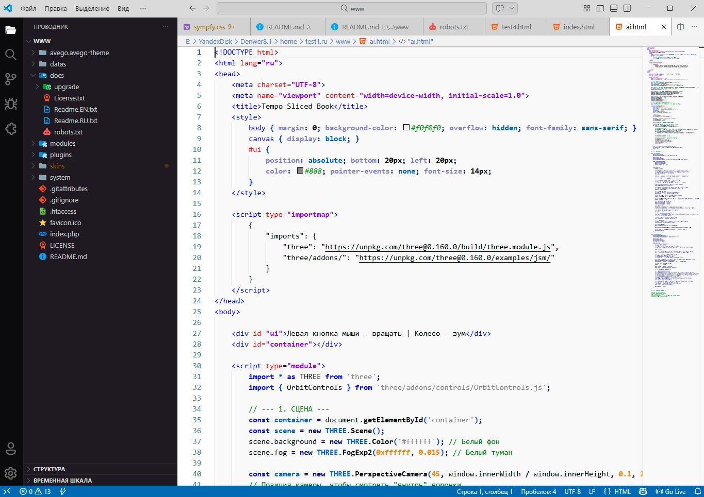

# Notepad++ Avego

**Exact recreation of the classic Notepad++ syntax highlighting — now in Visual Studio Code.**

The familiar light theme many developers used for years: green comments, bold blue keywords, gray strings, orange numbers — nothing extra, just the proven classic look.

### Screenshots

**PHP**  
Classic Notepad++ colors: green comments, bold blue keywords, orange numbers, gray strings.

**CSS**  
Bold properties, orange values, blue pseudo-classes — exactly like in Notepad++.

**HTML + CSS + JavaScript**  
Mixed file preview — blue tags, red attributes, bold blue JS keywords — perfect for web developers.

### Why people love this theme

- 1:1 match with default Notepad++ syntax highlighting
- Extremely readable light background
- No modern experiments — pure nostalgia and practicality
- Works great with PHP, HTML, CSS, JavaScript, Python, C++, Java, JSON, Markdown and many more
- Lightweight and fast

### Installation

1. Open **Extensions** view (`Ctrl+Shift+X`)
2. Search for **Notepad++ Avego**
3. Click **Install**
4. Open Command Palette (`Ctrl+Shift+P`) → type **Preferences: Color Theme** → select **Notepad++ Avego**

Done!

### Made by Avego Web Studio (Astrakhan, Russia)

We build modern websites and help businesses grow online.  
This theme is our small tribute to everyone who started coding with Notepad++ — just like us.

- Website: https://avego.org  
- Phone / WhatsApp / Telegram: +7 (988) 171-64-99
- E-mail: info@avego.org

---

**Happy old-school coding!** ✨